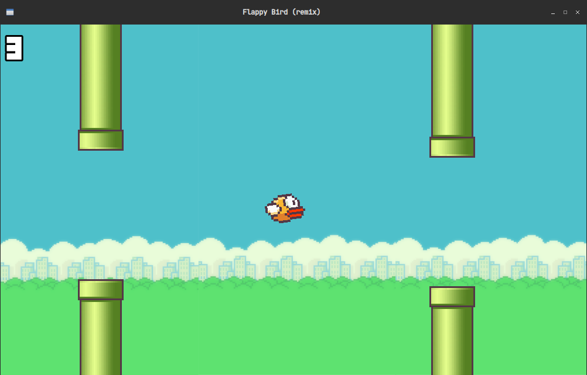
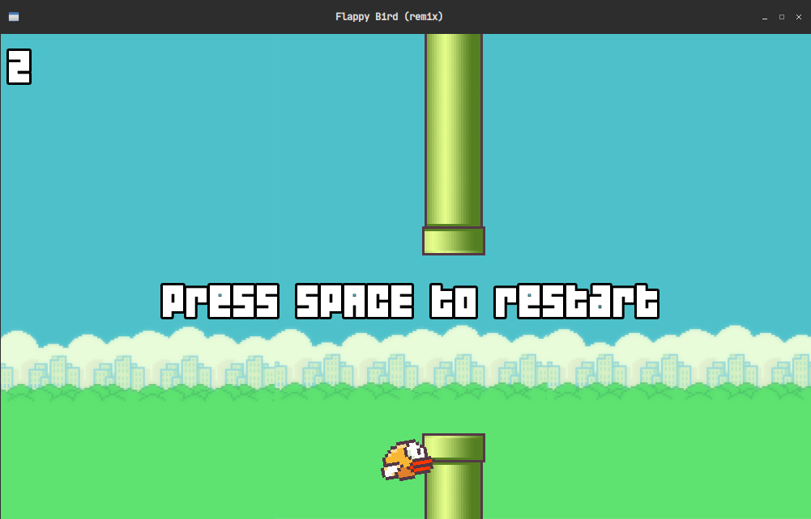

# Flappy Bird

The famous game made with C++ and SFML

---

# Dependencies

+ [g++](https://github.com/gcc-mirror/gcc)
+ [SFML](https://github.com/SFML/SFML/)
+ [Make](https://github.com/wkusnierczyk/make)

---

# Building and Run

```bash
git clone https://github.com/Moneeeeee/FlappyBird.git
cd FlappyBird
make
```


---


## **FlappyBird 介绍**

##### 1.程序使用 C ++的图形库 - SFML，我把它的基本教程放在了博客中，以下是我的博客链接。

##### 2.我的设计流程和每个函数的介绍（中文版）在名为“C/C++课设报告”的文件夹里，我相信只要你阅读了它，你就可以理解我的思路和程序

##### 4. 花了四天就完成的作品，可能还有一些潜在的错误，如果你发现的话请联系我，这是我的邮箱：moneeeeee@163.com 

##### 5.游戏截图





Game made in the video tutorial: <https://youtu.be/lPDl6ul8-wg>
